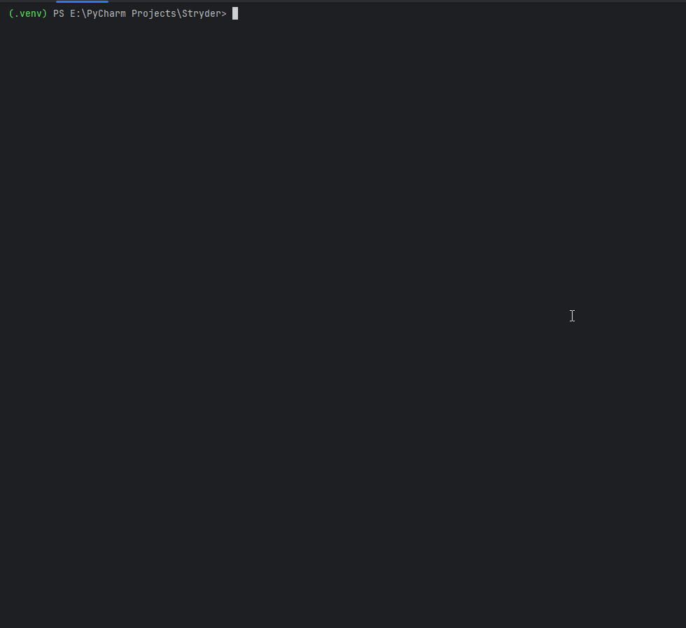
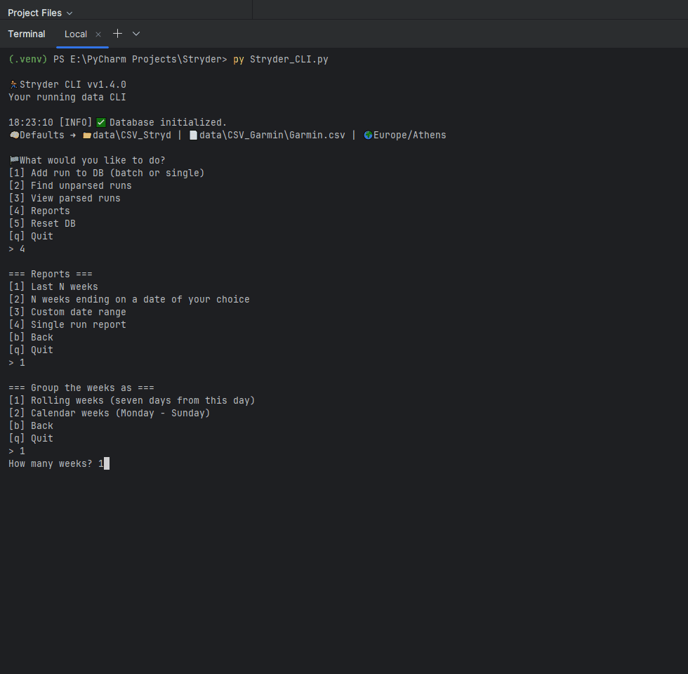
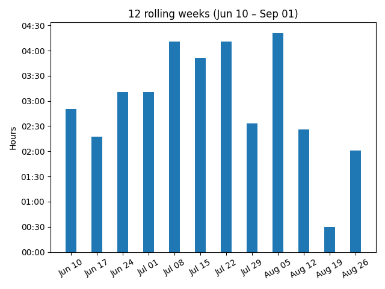
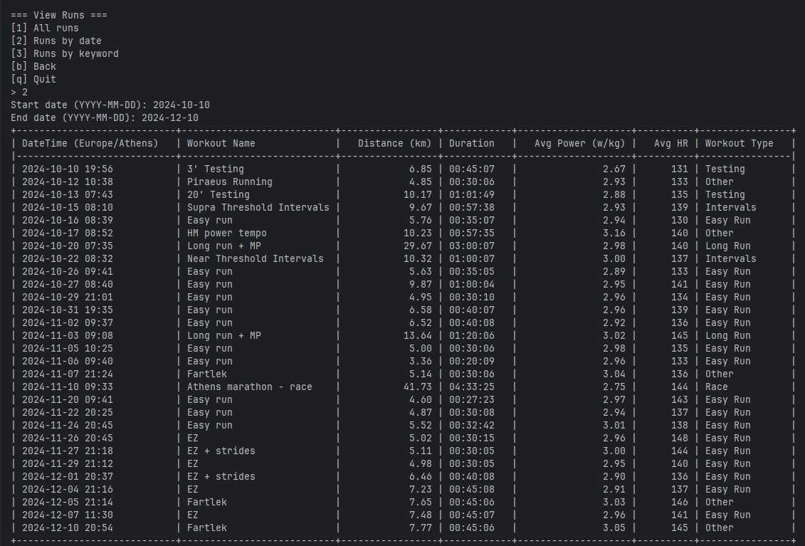

# Stryder CLI 🏃‍♂️

As a hobbyist runner getting into coding, I built this command-line tool to help organize and analyze my running data using CSV files from Stryd footpod. It stores the cleaned data in a local SQLite database for easy access and future analysis.

---

## 📽️ Demo
### 1. Clean CLI Menu
Navigate easily through the launcher menu.



---

### 2. Weekly & Rolling Reports
Generate 1-week, 4-week, or 12-week reports with distance, avg HR, power, and duration.



---

### 3. Visual Reports
Visualize your training load with automatic plots.



---

### 4. Detailed Views
Inspect any run in detail with normalized workout names, timestamps, and metrics.



---

---

## ✨ Features
- **Interactive CLI menu** — easy navigation through all options  
- **Import Stryd CSVs** and store them in a local SQLite database  
- **View every run** with clean tabulated CLI tables  
- **Custom weekly reports** with averages for distance, duration, power, and HR  
- **Export visual charts** to track mileage, power, and heart rate trends 

---

## 📄 Files You Need

Before using Stryder, make sure you have the following:

### ✅ Stryd CSV Files

These are your **detailed per-run files**, exported from Stryd PowerCenter or the mobile app. Each file contains second-by-second metrics such as pace, power, cadence, etc.

🗂 Export them in **bulk** and place them all in a folder. Each file typically has a long numeric filename, like:

5059274362093568.csv,
5073428460371968.csv

💡 You’ll be prompted to select this folder during batch import.

---

### ✅ Garmin CSV Export

This is a **single CSV file** containing summary data for your Garmin runs — one row per workout — with columns like start time, duration, and distance.

To download it:
1. Visit [Garmin Connect](https://connect.garmin.com/)
2. Go to your activities list
3. Export all (or running-only) activities as a `.csv` file

It will be named something like:

 activities.csv

💡 This is the file you'll be prompted to provide as the "Garmin file."

---

⚠️ The app uses the **start time** from each Stryd file to match it with the correct Garmin run. The match is made using timezone-aware comparison with a ±60 second tolerance.

---

## ⚙️ Features

- 🛠️ Initialize or reset the SQLite database
- 📂 Batch or single import Stryd CSVs with automatic Garmin run matching
- 📄 Weekly reports of mileage,duration,avg power and HR
- 🔍 Detect and handle unmatched Stryd runs
- 🧠 Remembers last-used folders between sessions
- 🌍 Timezone handling with user prompting and suggestions
- ✅ Ensures only Garmin-matched runs are stored — unless overridden

---

## 🖥️ Example CLI Output

🌀 Stryder CLI v1.4.0

---

### 🖥️ Demo

---

## ▶️ Getting Started

```bash
# Install dependencies
pip install -r requirements.txt

# Start here for the main menu
python Stryder_CLI.py

# CLI Help
python Stryder_CLI.py --help

```
---

## 🛠 Tech Stack

- Python 3.11
- SQLite
- Pandas
- Matplotlib
- Tabulate


---

## 🧭 Roadmap

These are planned or possible features for future versions of Stryder:

- [x] Basic CLI with Stryd + Garmin import
- [x] Timezone prompt and matching tolerance
- [x] Skipping unmatched runs for later review
- [x] Store last-used file paths
- [x] Add CLI commands for viewing runs and summaries
- [x] Weekly/monthly mileage summaries
- [x] Graphs: power, distance, duration and HR over time 
- [ ] Support .fit/.tcx/.gpx file parsing
- [ ] Optional GUI (e.g., Streamlit or PyQt)
- [ ] Export to Excel or CSV with filters

## 👤 Author
Giorgos Chrysopoulos

Beginner Python Developer & Hobbyist Runner

🔗 [LinkedIn](https://www.linkedin.com/in/giorgos-chrisopoulos-277989374/)

💡 Want to contribute? Open an issue or fork the repo!

---

## 📃 License
MIT License — see the [LICENSE](LICENSE) file.


