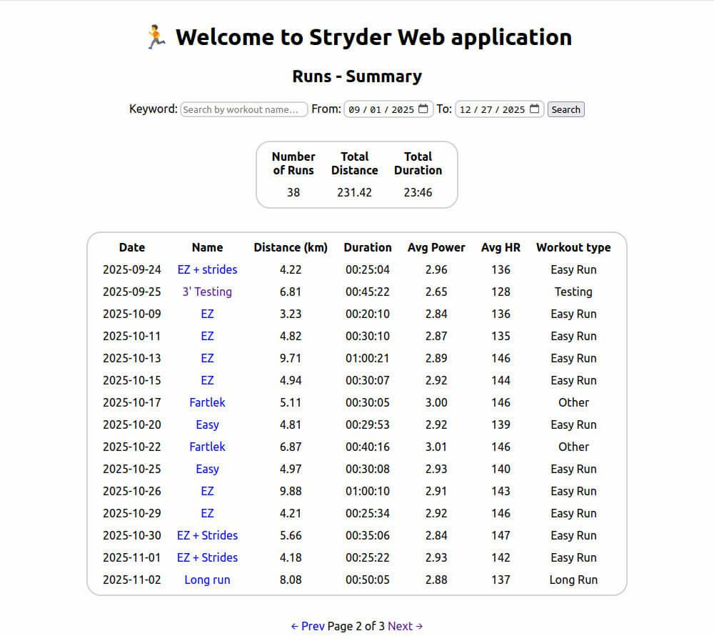
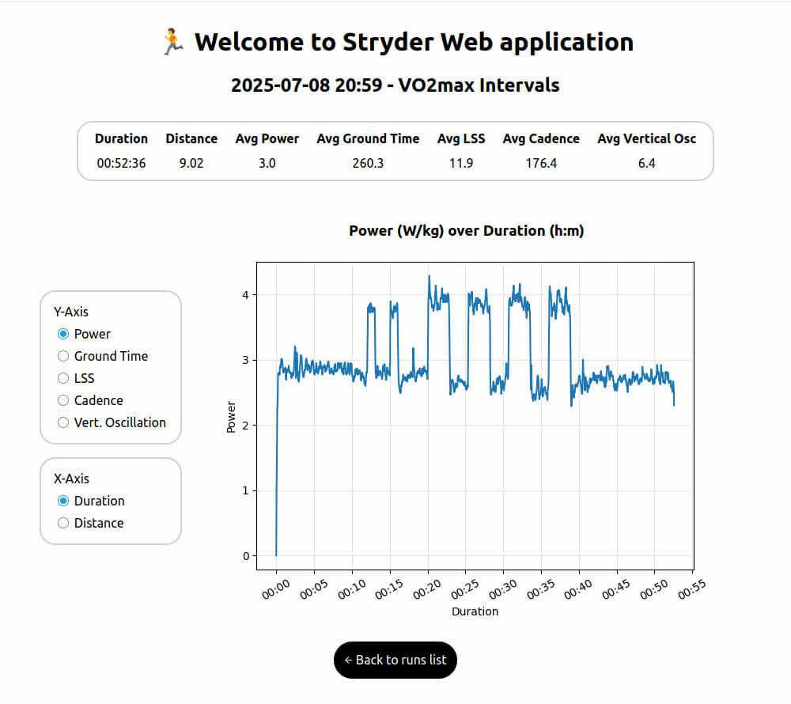

# Stryder 🏃‍♂️  
### Local Running Data Analysis — TUI & Web Viewer

Stryder is a modular, local-first running data management system built around **Stryd and Garmin CSV exports**.

It provides multiple interfaces on top of the same shared core:

- **Stryder Core** handles parsing, matching, normalization, and metrics.
- **Stryder TUI** (Textual) provides a full-screen interactive terminal interface.
- **Stryder Web** (Django) provides a read-only web viewer on the same database.

Stryder is designed both as a personal analytics tool and as a software architecture learning project focused on modular design and multi-interface systems.

---

# 🧱 Architecture Overview

Stryder is structured as a multi-layer application:

## 🧠 Stryder Core
- Shared business logic used by all interfaces
- CSV parsing and normalization
- Timezone-aware Garmin ↔ Stryd matching (±60s tolerance)
- Canonical metrics and summaries
- SQLite database schema

## 🖥️ Stryder TUI (Textual)
- Interactive terminal-based UI built with Textual
- Async import workflow with live progress
- Integrated find-unparsed review flow
- DataTable-based run navigation with pagination
- Terminal graph visualizations (plotext)
- Non-blocking background workers

## 🌐 Stryder Web (Django)
- Local web viewer running on Django
- Single run detailed reports with interactive graphs
- Custom date range reports
- User-selectable X/Y axes
- Read-only by design (no imports via web)

All interfaces operate on the **same SQLite database**, ensuring consistency across views.

---

# 📽️ Demo (Web Viewer)

### 1. Custom range run view
View your stored runs filtering them by custom dates or keywords.



---

### 2. Single run summary view
Visualize your training load with selectable axes.



---

# 📽️ Demo (TUI)

### Parse csv files and view reports
Easily parse your csv Stryd run files and then quick view them without leaving the terminal.


---

# ✨ Features

## Core
- Timezone-aware Stryd ↔ Garmin matching (±60s tolerance)
- Canonical metrics system (distance_km, avg_power, etc.)
- Normalized workout naming
- Local SQLite storage

## TUI
- Full-screen interactive terminal interface
- Background worker-based imports
- Integrated unmatched-run review workflow
- Paginated run views
- Terminal graph visualizations

## Web
- Single run detailed reports
- Custom date range analysis
- Interactive X/Y axis selection
- Clean page-based layout

---

# 📄 Files You Need

Before using Stryder, make sure you have:

## ✅ Stryd CSV Files

Detailed per-run CSV files exported from Stryd PowerCenter or the mobile app.

Each file contains second-by-second metrics (pace, power, cadence, etc.).

Export them in bulk and place them in a folder.

Example filenames:

```
5059274362093568.csv  
5073428460371968.csv  
```
---

## ✅ Garmin CSV Export

A single CSV file containing summary data for your Garmin runs.

To download:

1. Visit https://connect.garmin.com/  
2. Go to Activities  
3. Export all (or running-only) activities as `.csv`

Example filename:

```
activities.csv 
``` 

⚠️ Stryder matches runs using start timestamps with timezone-aware comparison and a ±60 second tolerance.

---

# 🧪 Demo Data (Included)

For quick testing, the repository includes example files:

- assets/stryd/ → Sample Stryd per-run CSV files  
- assets/garmin/ → Matching Garmin activities CSV  

You can use these to test the full import and reporting pipeline without exporting your own data.

Simply point Stryder to these paths during import.

---

# ▶️ Getting Started

## 1️⃣ Install dependencies

```
pip install -r requirements.txt
```
---

## 2️⃣ Run the Textual TUI (Recommended)
```
python -m stryder_tui
```
The TUI allows you to:

- Import Stryd and Garmin CSV files
- Review unmatched runs
- View reports and summaries
- Navigate runs interactively

---

## 3️⃣ Run the Web Viewer
```
python manage.py runserver
```
The web interface:

- Reads from the same SQLite database
- Provides interactive visual reports
- Does not import or modify data

---

# 🧩 CLI Status

A legacy menu-based CLI is still included in the repository but is not the recommended interface in v1.8.

Stryder is currently **TUI-first**.

The CLI will be redesigned as a true command-driven interface in a future major release.

---

# 🛠 Tech Stack

## Core
- Python 3.11
- SQLite
- Pandas

## TUI
- Textual
- Plotext

## Web
- Django
- HTML / CSS (Django templates)
- Matplotlib (server-side rendering)

All interfaces share the same database and core logic.

---

# 🧭 Roadmap

- [x] CLI import & summaries
- [x] Canonical metrics refactor
- [x] Web viewer (Django)
- [x] Textual TUI interface
- [ ] Redesign CLI as command-driven interface (v2.0)
- [ ] Advanced run comparisons
- [ ] Segment-based analysis
- [ ] Export filtered data to CSV
- [ ] Support FIT / TCX / GPX parsing

---

# 👤 Author

Giorgos Chrysopoulos  
Junior Python Developer & Hobbyist Runner  

🔗 LinkedIn: https://www.linkedin.com/in/giorgos-chrisopoulos-277989374/

💡 Want to contribute? Open an issue or fork the repo!

---

# 📃 License
MIT License — see the LICENSE file.
